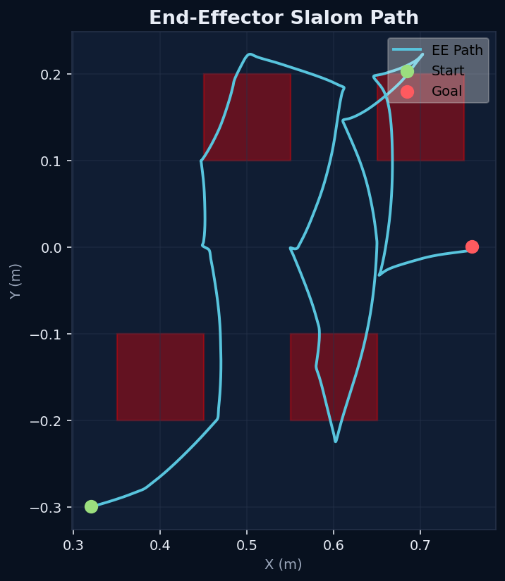

# Lab 4: Motion Planning & Collision Avoidance

A self-contained motion-planning lab built on the same canonical UR5e + Robotiq stack as Labs 2 and 3. Lab 4 introduces obstacles: Pinocchio FK, MuJoCo-geometry collision truth, an RRT/RRT* planner written from scratch, path shortcutting, time parameterization, and execution through the Lab 3 controller.

## Showcase



> The capstone demo plans a multi-segment RRT\* path that weaves the UR5e end-effector through 4 staggered tabletop obstacles, smooths it with shortcutting + time-parameterization, and executes it under joint-space PD + gravity compensation. A blocked-path validation scene (direct line collides) shortcuts a 35-waypoint raw RRT plan down to 3 waypoints and tracks to 0.0037 rad RMS.

## Key Results

| Metric | Value |
|---|---|
| Test suite | **44 passed, 1 skipped** (3 files: collision / planner / trajectory) |
| Standard capstone RMS tracking error | 0.0125 rad |
| Standard capstone final position error | 0.0016 rad |
| Blocked-path scene raw RRT path | 35 waypoints |
| Blocked-path scene shortcut path | 3 waypoints |
| Blocked-path scene raw cost | 9.895 |
| Blocked-path scene shortcut cost | 7.873 |
| Blocked-path scene trajectory duration | 2.659 s |
| Blocked-path scene RMS tracking error | 0.0037 rad |
| Blocked-path scene final position error | 0.0004 rad |

---

## Skills Demonstrated

- **C-space sampling planners from scratch**: RRT and RRT\* in 6-D joint space with goal bias, step-size clamping, rewiring, and parent-rewind during sampling.
- **Real-geometry collision truth**: collision checking runs against the *same* MuJoCo Menagerie UR5e + mounted Robotiq + obstacle geometry that execution uses — planner and controller agree on what "in collision" means.
- **Path shortcutting**: iterative collision-free shortcuts cut 35 raw RRT waypoints to 3 while reducing path cost by ~20 %.
- **Time-optimal parameterization**: `parameterize_topp_ra(...)` keeps a stable public API; uses TOPP-RA when installable and falls back to a conservative limits-respecting quintic otherwise.
- **Multi-segment slalom planning**: 9 Cartesian via-points at constant z=0.56 m with gap-midpoint anchors, planned segment-by-segment with seeded IK to keep the elbow on one side.
- **Reuse of the Lab 3 controller**: trajectory execution feeds Lab 3's PD + gravity compensation path through the Menagerie actuator model — no new low-level control code.

---

## Architecture

```text
Goal (start q → target q, obstacle list)
        │
        ▼
┌──────────────────────────┐
│  Collision Checker        │
│  MuJoCo geometry truth    │
│  (self + environment)     │
└──────────┬───────────────┘
           │
           ▼
┌──────────────────────────┐
│  RRT* Planner             │
│  Sample → Extend → Rewire │
└──────────┬───────────────┘
           │ waypoints in C-space
           ▼
┌──────────────────────────┐
│  Trajectory Smoother      │
│  Shortcutting + TOPP-RA   │
│  (quintic fallback)       │
└──────────┬───────────────┘
           │ timed trajectory
           ▼
┌──────────────────────────┐
│  Trajectory Executor      │
│  Lab 3 PD + gravity comp  │
│  through Menagerie acts   │
└──────────────────────────┘
```

Planning-time collision truth comes from the same MuJoCo robot and obstacle geometry that execution uses. Pinocchio is retained for FK and the gravity-compensation term during execution.

---

## Modules

| File | Role |
|---|---|
| `src/lab4_common.py` | Canonical scene/model loading, obstacle specs, actuator helpers |
| `src/collision_checker.py` | Collision queries on the executed MuJoCo geometry |
| `src/rrt_planner.py` | RRT / RRT\* in joint space |
| `src/trajectory_smoother.py` | Shortcutting + time parameterization (TOPP-RA + quintic fallback) |
| `src/trajectory_executor.py` | Joint-space PD + gravity compensation execution |
| `src/capstone_demo.py` | Multi-segment slalom capstone (4 staggered tabletop obstacles) |
| `src/record_lab4_demo.py` | Three-phase demo video recorder |
| `src/record_lab4_validation.py` | Blocked-path validation video recorder |

---

## Quick Start

```bash
# From the repository root
pip install mujoco numpy pinocchio scipy "imageio[ffmpeg]" matplotlib

# Run the full test suite
python3 -m pytest lab-4-motion-planning/tests -q

# Run the capstone slalom demo
python3 lab-4-motion-planning/src/capstone_demo.py

# Re-record the validation video
python3 lab-4-motion-planning/src/record_lab4_validation.py
```

---

## Structure

```text
lab-4-motion-planning/
├── src/              Source modules + capstone + recorders
├── models/           UR5e collision URDF + MuJoCo scenes (obstacles)
├── docs/             English study notes (collision / RRT / smoothing / execution)
├── docs-turkish/     Turkish study notes
├── media/            Plots, slalom demo video, validation video
├── tests/            Pytest suite (44 passed, 1 skipped)
└── tasks/            PLAN / ARCHITECTURE / TODO / LESSONS
```

---

## Documentation

| Topic | English | Turkish |
|---|---|---|
| 01 — Collision checking | [Collision Checking](docs/01_collision_checking.md) | [Çarpışma Kontrolü](docs-turkish/01_carpisma_kontrolu.md) |
| 02 — RRT / RRT\* planning | [RRT Planning](docs/02_rrt_planning.md) | [RRT Planlama](docs-turkish/02_rrt_planlama.md) |
| 03 — Trajectory processing | [Trajectory Processing](docs/03_trajectory_processing.md) | [Yol İşleme](docs-turkish/03_yol_isleme.md) |
| 04 — Trajectory execution | [Trajectory Execution](docs/04_trajectory_execution.md) | [Yol Takibi](docs-turkish/04_yol_takibi.md) |

---

## Media

- Capstone EE trajectory: [`media/capstone_ee_trajectory.png`](media/capstone_ee_trajectory.png)
- RRT vs RRT\* tree comparison: [`media/capstone_rrt_tree.png`](media/capstone_rrt_tree.png), [`media/capstone_rrt_star_tree.png`](media/capstone_rrt_star_tree.png)
- Execution comparison: [`media/capstone_execution_comparison.png`](media/capstone_execution_comparison.png), [`media/capstone_tracking.png`](media/capstone_tracking.png), [`media/capstone_clearance.png`](media/capstone_clearance.png)
- Single-segment RRT plots: [`media/rrt_plan.png`](media/rrt_plan.png), [`media/rrt_star_plan.png`](media/rrt_star_plan.png)
- Raw vs smooth comparison: [`media/raw_vs_smooth_comparison.png`](media/raw_vs_smooth_comparison.png)
- Slalom profile / cost / tree / velocity / clearance: `media/slalom_*.png` + `media/slalom_metrics.json`
- Slalom demo video: [`media/lab4_slalom_demo.mp4`](media/lab4_slalom_demo.mp4)
- Validation video: [`media/lab4_validation_real_stack.mp4`](media/lab4_validation_real_stack.mp4)

---

## Notes

- The TOPP-RA package could not be built in the sign-off environment (no system compiler / no prebuilt wheel for the available Python). The smoother keeps the `parameterize_topp_ra(...)` API and falls back to a conservative quintic time parameterization that respects the configured velocity and acceleration limits. When TOPP-RA is installable, the API is unchanged.
- The planner intentionally excludes mechanically adjacent gripper-internal pairs from the self-collision set, since minimum-distance queries at `Q_HOME` would otherwise report tiny negative values for finger linkage proximity that is not real planning signal.
- Trajectory execution maps desired arm torques through the Menagerie actuator model rather than writing torques directly into `mj_data.ctrl[:6]` — this matches the canonical Lab 3 execution path.

---

## License

The Lab 4 source code and original documentation are covered by the repository root [Apache-2.0 license](../LICENSE).

Bundled robot description packages and model assets in [`models/`](models/) and the Menagerie assets reused from Lab 2 keep their upstream licenses. See the repository root [THIRD_PARTY_NOTICES.md](../THIRD_PARTY_NOTICES.md) for the exact carve-outs.
